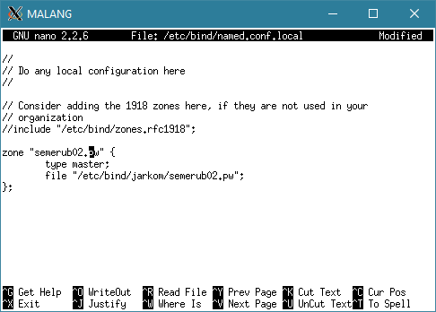
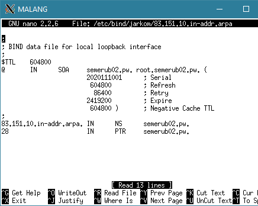
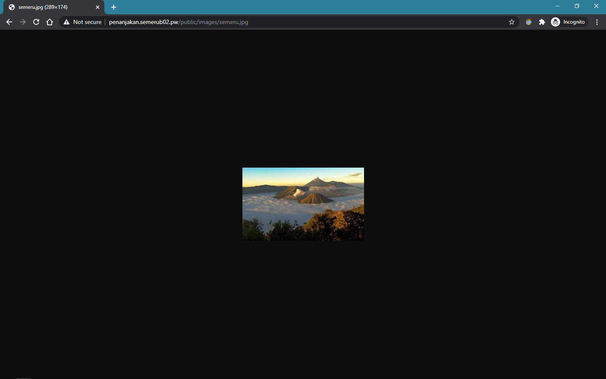

1.  **Pertama membuat domain dengan mengisikan konfigurasi untuk semerub02.pw di MALANG seperti berikut**

> 

-   Buat folder jarkom di dalam /etc/bind

-   Copykan file db.local pada path /etc/bind ke dalam folder jarkom
    > yang baru saja dibuat dan ubah namanya menjadi semerub02.pw

-   Kemudian buka file semerub02.pw dan edit seperti gambar berikut

> 
>
> Setelah di restart bind9 nya dan dicoba hasilnya,
>
> 

2.  **Lalu untuk membuat alias sebagai berikut**

> 
>
> Lalu hasilnya setelah di coba ping,
>
> 

3.  **Lalu untu membuat subdomain**

> 
>
> Hasilnya,
>
> 

4.  **Lalu untuk membuat reverse domain**

-   Edit file /etc/bind/named.conf.local pada *MALANG*

-   Lalu tambahkan konfigurasi berikut ke dalam file named.conf.local

> 

-   Copykan file db.local pada path /etc/bind ke dalam folder jarkom
    > yang baru saja dibuat dan ubah namanya menjadi
    > 83.151.10.in-addr.arpa

-   Edit file 83.151.10.in-addr.arpa menjadi seperti gambar di bawah ini

> 
>
> Setelah itu restart Malang dan jika dicoba pada Gresik hasilnya,
>
> 

5.  **Membuat DNS Server Slave**

Edit file /etc/bind/named.conf.local dan sesuaikan dengan syntax berikut

> 
>
> Kemudian buka file /etc/bind/named.conf.local pada MOJOKERTO dan
> tambahkan syntax berikut:
>
> 

Lalu untuk testing, pertama kita matikan MALANG

> 
>
> Lalu setelah MALANG di matikan kita test dan hasilnya seperti berikut,
>
> 

6.  **Membuat subdomain di delagasikan ke MOJOKERTO dan mengarah ke PROBOLINGGO**

> Ubah pada MALANG dengan menambahkan subdomain baru,
>
> 

-   Kemudian edit file /etc/bind/named.conf.options pada *MALANG*.

-   Kemudian comment dnssec-validation auto; dan tambahkan baris berikut
    > pada /etc/bind/named.conf.options

> 

-   Pada *MOJOKERTO* edit file /etc/bind/named.conf.options

-   Kemudian comment dnssec-validation auto; dan tambahkan baris berikut
    > pada /etc/bind/named.conf.options

> 

-   Kemudian buat direktori dengan nama delegasi lalu copy db.local ke
    > direktori pucang dan edit namanya menjadi gunung.semerub02.pw

-   Kemudian edit file gunung.semerub02.pw menjadi seperti dibawah ini

> 
>
> Lalu saat dicoba pada GRESIK hasilnya,
>
> 

7.  **Membuat subdomain naik.gunung.semerub02.pw**

> Pada MOJOKERTO ditambahkan sebagai berikut,
>
> 
>
> Lalu jika kita coba di GRESIK hasilnya,
>
> 

8.  **Mengatur webserver untuk Domain semerub02.pw**

> Dengan menambahkan ServerName dan DocumentRoot
>
> 

Lalu untuk melihat hasilnya dapat diakses dengan browser semerub02.pw

> 

9.  **Menghilangkan index.php**

> Aktifkan a2enmod rewrite
>
> 

Lalu untuk semerub02.pw, AllowOverride diganti All

> 
>
> Lalu edit file .htaccess dan isikan seperti berikut
>
> 

Lalu untuk melihat hasilnya tinggal di coba untuk semerub02.pw/home

> 

10. **Mensetting penanjakan.semerub02.pw**

> Ekstrak file ke folder penanjakan.semerub02.pw
>
> 

Lalu tambahkan ServerName dan DocumentRoot dengan
penanjakan.semerub02.pw

> 
>
> Lalu aktifkan a2ensite penanjakan
>
> 
>
> Hasilnya jika dibuka penanjakan.semerub02.pw
>
> 

11. **Listing pada /public tanpa public/\***

> Tambahkan Option +Indexes untuk directory
> penanjakan.semerub02.pw/public
>
> Dan tambahkan Option -Indexes untuk directory
> penanjakan.semerub02.pw/public/\*
>
> 

Hasilnya saat mengakses penanjakan.semerub02.pw/public/

> 

Hasilnya saat mengakses penanjakan.semerub02.pw/public/css/

> 

12. **Merubah error page dengan 404.html**

> Dengan menambahkan ErrorDocument 404 /errors/404.html
>
> 
>
> Lalu apache di restart
>
> 
>
> Hasilnya saat mengakses link yang tidak ada
>
> 

13. **Mengubah inisial untuk folder javascript**

> Dengan menambahkan Alias dengan memberinya alias "/js"
>
> 
>
> Lalu restart apache
>
> 
>
> Hasilnya saat mengakses penanjakan.semerub02.pw/js\
> *\*tidak lagi not found, karena folder javascript memang tidak bisa
> diakses*
>
> 

14. **Membuat naik.gunung.semerub02.pw di port 8888**

> Setting virtual host di port 8888, tambahkan server name dan document
> root untuk naik.gunung.semerub02.pw
>
> 
>
> Lalu pada ports.conf Listen untuk port 8888
>
> 

Lalu restart apache

> 
>
> Lalu hasilnya jika mengakses naik.gunung.semerub02.pw:8888
>
> 

15. **Memberikan Auth pada naik.gunung.semerub02.pw**

> Membuat user "semeru" dan password "kuynaikgunung" dengan perintah
> dibawah
>
> 
>
> Lalu tambahkan Auth untuk directory naik.gunung.semerub02.pw
>
> 
>
> Lalu restart apache
>
> 
>
> Hasilnya saat mengakses naik.gunung.semerub02.pw:8888
>
> 
>
> Setelah memsukkan username dan password yang sesuai
>
> 

16. **Mengarahkan 10.151.83.28**

> Test ip 10.151.83.28
>
> 
>
> Rubah .htaccess default pada PROBOLINGGO untuk meredirect ip
> PROBOLINGGO ke semerub02.pw
>
> 
>
> Ganti allowoverride none jadi all untuk directory /var/www/
>
> 
>
> Lalu restart apache
>
> 
>
> Hasilnya saat mengakses 10.151.83.28
>
> 

17. **Mengubah semua gambar yang mengadung "semeru" ke semeru.jpg**

> Awalnya
>
> 
>
> Rubah file .htaccess sesuai berikut
>
> 
>
> Tambahkan AllowOverride All untuk directory penanjakan.semerub02.pw

> 

> Hasilnya semua akses file gambar yang mengandung "semeru" akan
> diarahkan ke semeru.jpg
>
> 
